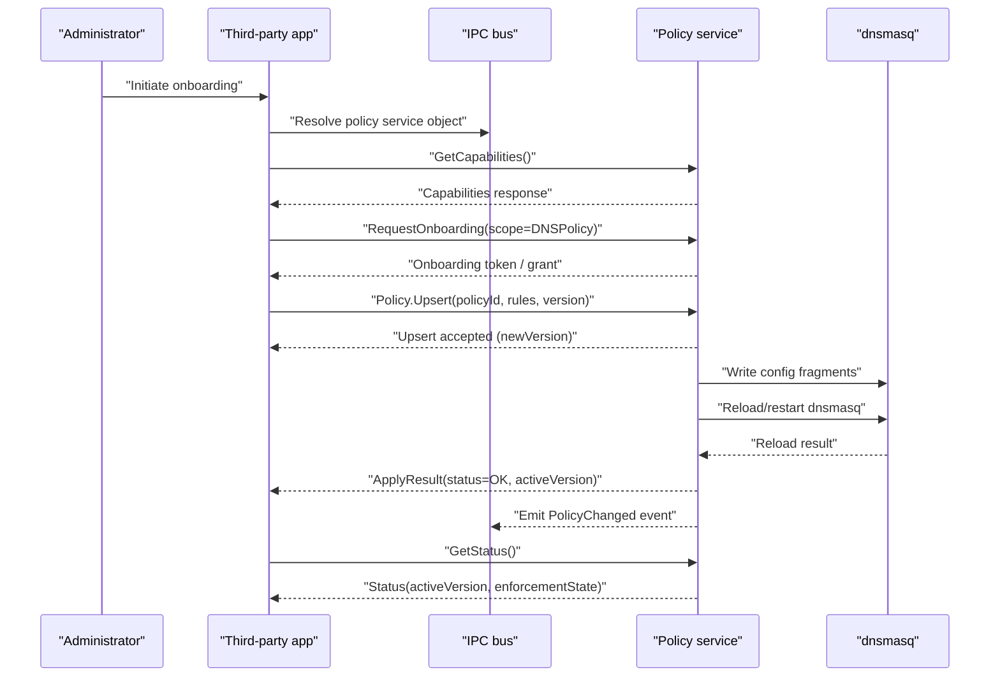
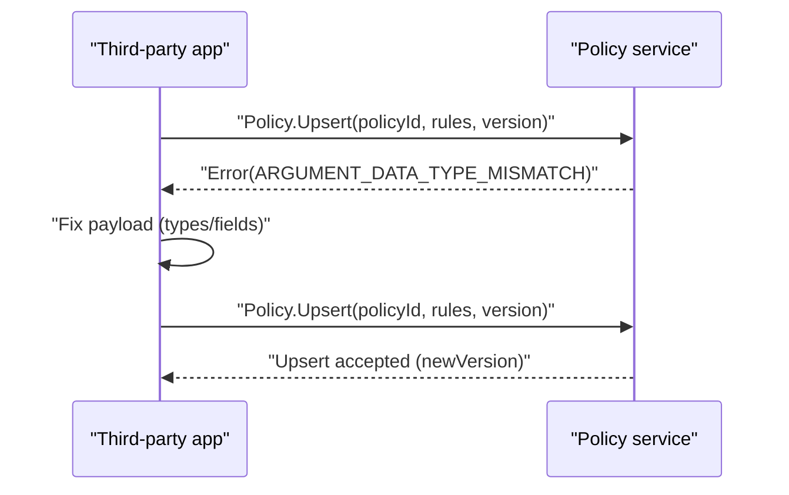
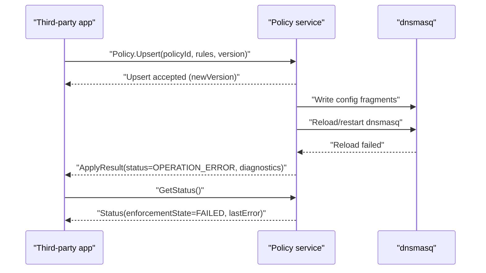

# Third-Party App Integration Onboarding (Local Gateway App) — Use-Case Flow

## Purpose and scope

This document specifies the onboarding lifecycle and end-to-end use-case flow for integrating a third-party “local gateway app” with a prpl-based gateway. The app uses an IPC bus style consistent with uBus/NBAPI-like interactions, can push policies, and those policies are automatically applied. DNS enforcement is implemented using `dnsmasq`-style local DNS policy, with explicit limitations noted for encrypted DNS.

This document is intentionally documentation-only and does not implement code.

## Actors and responsibilities

The flow assumes the following roles, each with clear boundaries:

The administrator is a human operator who grants consent for the third-party app to manage specific policies.

The third-party app is a local process on the gateway device (or an adjacent trusted host with local IPC access) which performs onboarding and then pushes policies.

The IPC bus is the local message bus through which requests are invoked and events are published. In this stack, uBus-style interactions exist already and are used for event delivery in platform code.

The policy service is a daemon or component responsible for validating, persisting, and applying policies into enforcement subsystems. In the current stack, NBAPI/Ambiorix provides a data model access layer that can be used to manage configuration state and functions in a uBus-like manner.

The enforcement layer is `dnsmasq` configuration and reload behavior (and any supplemental hooks needed to ensure the DNS policy is actually used by LAN clients).

## Terminology

A policy is a named set of rules describing desired enforcement behavior. In this use-case, the initial policy scope is DNS-centric controls such as domain allow/deny lists, DNS rewrite, and (optionally) client scoping.

A policy version is a monotonically increasing integer or a content hash used to support idempotent updates and safe retries.

A policy target is the enforcement subsystem that is affected, such as `dnsmasq`.

## Preconditions

The gateway platform has an IPC bus available. Existing platform code shows uBus connectivity and event handling patterns (for example DHCP monitoring).

The third-party app can reach the IPC bus (local socket, correct permissions) and has a way to authenticate/authorize its calls.

The gateway is running a DNS forwarder on the LAN side and it is feasible to enforce DNS policy by adjusting its configuration.

## Primary lifecycle flow

The lifecycle is designed to be durable and replayable. Every step is defined to be idempotent or to provide a conflict response that callers can use to converge to the desired state.

### Step 1: Discovery and capability query

The third-party app discovers the policy service object on the IPC bus and queries:

Whether policy management is enabled.

Which enforcement capabilities exist (for example, domain block lists, per-client scoping support, reload behavior).

Which policy schema versions are supported.

### Step 2: Consent and onboarding

The administrator authorizes the third-party app to manage DNS policy. The system must bind the app identity to an authorization scope and audit this decision.

### Step 3: Policy push (create/update)

The third-party app submits a desired policy (or delta) to the policy service.

The policy service validates the payload, persists it, and produces an “effective policy” representation suitable for the enforcement layer.

### Step 4: Auto-apply and enforcement update

The policy service applies the effective policy by updating `dnsmasq`-consumable configuration fragments and triggering a reload.

The apply operation produces an apply result containing:

A policy version (or revision) that is now active.

The enforcement status (success, partial, failed).

Diagnostics including which rules were accepted, rejected, or downgraded due to platform limitations.

### Step 5: Monitoring and change events

The third-party app subscribes to policy and enforcement events and remains synchronized by reconciling the active policy version.

## Sequence diagrams

### Happy path: Onboard and apply a DNS policy

### Failure path: Validation error and idempotent retry

### Failure path: dnsmasq reload fails, policy is persisted but not enforced

## Persistence model (conceptual)

The system should persist at least:

The last submitted policy per policyId.

The computed effective policy.

The active policy version.

The last enforcement apply result and timestamp.

The audit trail for onboarding and changes (who/what changed which policy and when).

The exact persistence mechanism is not specified here; the goal is to ensure that the state survives restarts and can be reconciled by the third-party app.

## DNS enforcement notes and limitations

DNS enforcement via `dnsmasq` is effective only if LAN clients actually use the gateway DNS (or are redirected to it). This document assumes the gateway environment can ensure that behavior through existing network configuration and/or firewall redirection, but the concrete mechanism is out of scope here.

Encrypted DNS protocols reduce the effectiveness of DNS-based policy:

DNS over HTTPS (DoH) and DNS over TLS (DoT) can bypass `dnsmasq` if clients use direct encrypted resolvers. DNS-only enforcement therefore cannot guarantee domain blocking for such clients without additional controls (for example, blocking known DoH endpoints, or enforcing a resolver via network policy). This limitation must be documented to users and reflected in the policy service diagnostics.

## Observability expectations

The policy service should provide enough structured information to debug issues without code-level tracing:

Each policy apply should have an operation identifier.

The apply result should contain a high-level status and a list of per-rule outcomes (accepted, rejected, downgraded).

The system should emit events for policy changes and enforcement state transitions.

## Out of scope

This use-case does not define a full policy language across all prplMesh features. It focuses on third-party onboarding and DNS enforcement.

This use-case does not require implementing an HTTP server or cloud integration. The third-party app is local and uses local IPC.

This use-case does not specify the internal database schema of prplMesh; it specifies required state and behaviors at the contract boundary.
